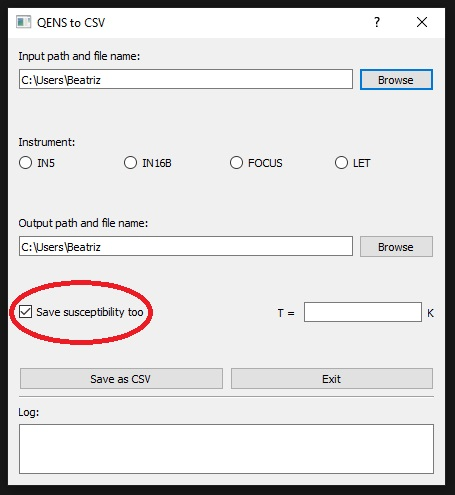

# About
QENS to csv sorts data collected at [IN5](https://www.ill.eu/for-ill-users/instruments/instruments-list/in5/description/instrument-layout) and [IN16B](https://www.ill.eu/for-ill-users/instruments/instruments-list/in16b/description/instrument-layout) at [ILL](https://www.ill.eu/) (Grenoble, France), [FOCUS](https://www.psi.ch/en/sinq/focus) at [PSI](https://www.psi.ch/en/cnm) (Villigen, Switzerland) and [LET](https://www.isis.stfc.ac.uk/Pages/let.aspx) at [ISIS](https://www.isis.stfc.ac.uk/Pages/home.aspx) (Oxfordshire, UK). Input data files should be text files (*.inx, *.txt, *.dat) obtained from the reduction of raw data using some existing software ([Lamp](https://www.ill.eu/for-ill-users/support-labs-infrastructure/software-scientific-tools/lamp), [DAVE](https://www.ncnr.nist.gov/dave/index.html), [Mantid](https://www.mantidproject.org/), [MSlice](http://mslice.isis.rl.ac.uk), etc). Sample data files from each instrument are provided as an example.

# Appearance
QENS to csv App's interface looks like this:

*QENS to csv App GUI.*

# Usage
1. Write the absolute path and input file name in the corresponding edit box. Alternatively, you can click the **Browse** button to open a File Explorer window and select the input file.

2. Select the instrument where the data was obtained.

3. Write the absolute path and output file name in the corresponding edit box. Again, you can click the corresponding **Browse** button to open a File Exporer window and give a name to the output file.

4. Click the **Save as CSV** botton to export the sorted data. 

5. There is option to calculate the susceptibility $\chi(Q, E)$ and export it to another file. To activate this option, you have to mark the **Save susceptivility too** checkbox. 

   

   Once checked, the temperature edit box will be active to write the corresponding value. When you click the **Save as CSV** botton both, the scattered intensity $S(Q, E)$ and the corresponding susceptivility $\chi(Q, E)$, will be exported to csv files. The name of the susceptivility file will be the same as the scattered intensity one, with "_chi" appended.
